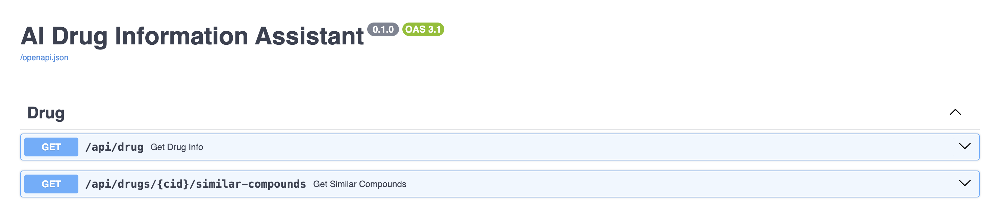

# README

## Drug Info Assistant

This is an open-source project designed to help the scientific community search about drug related information.

This is the Backend API, that integrates with the public PubChem PUG-REST API to retrieve relevant information about drugs.

This small app has been developed using Python with FastAPI and containerized using Docker, and is deployed online at Vercel.

The API is online and you can play with it:

#### Get Drugs information

```
GET https://drug-info-assistant.vercel.app/api/drug?name=paracetamol

=> 

{
    "iupac_name": "N-(4-hydroxyphenyl)acetamide",
    "molecular_formula": "C8H9NO2",
    "molecular_weight": "151.16",
    "log_p": 0.5,
    "smiles": "CC(=O)NC1=CC=C(C=C1)O",
    "inchi": "InChI=1S/C8H9NO2/c1-6(10)9-7-2-4-8(11)5-3-7/h2-5,11H,1H3,(H,9,10)",
    "cid": 1983
}
```
#### Get similar drug compounds

```
GET https://drug-info-assistant.vercel.app/api/drugs/1983/similar-compounds

=> 

{
    "cids": [
        1983,
        5931,
        11972,
        12124,
        31208,
        83939,
        6604822,
        ...
    ] 
}
```

### Start the server

The easiest way to install this app would be using Docker, so please download and install it if you don't have it.

Then, to start the server locally, just run: 
```
make build
make up
```
and the API should be ready to use at http://localhost:9000

###  API Endpoints



With FastAPI we easily create API documentation for the endpoints, which can be accessed at: https://drug-info-assistant.vercel.app/docs or locally at http://localhost:8000/docs


